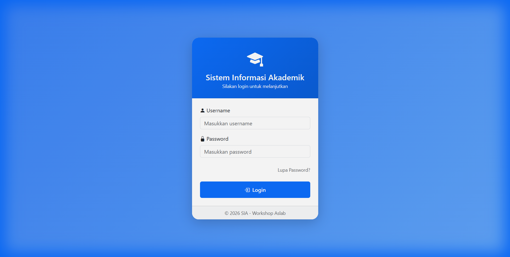
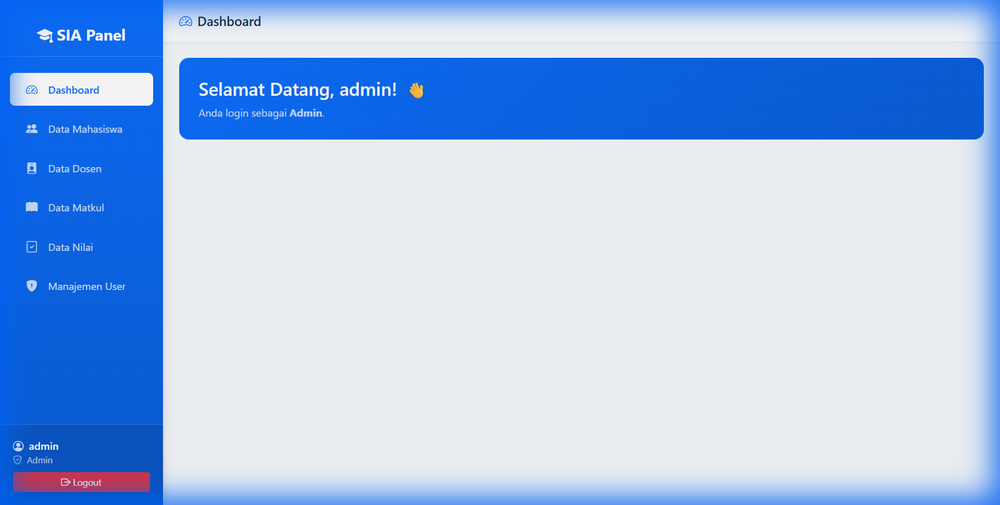
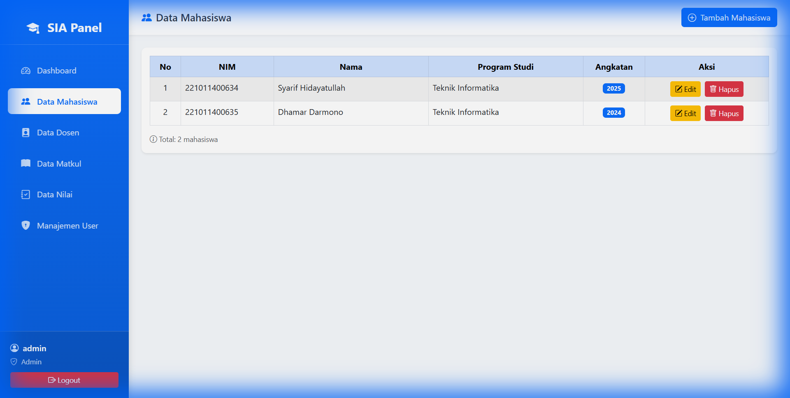

# Workshop ASLAB - Sistem Informasi Akademik (SIA)

## Tentang Aplikasi
Aplikasi ini adalah sistem informasi akademik sederhana yang dibangun menggunakan PHP Native dan MySQL. Aplikasi ini mencakup manajemen data mahasiswa, dosen, mata kuliah, dan nilai, dengan pemisahan hak akses antara Admin, Dosen, dan Mahasiswa.

## Teknologi yang Digunakan
*   **Backend**: PHP Native (OOP Implementation for CRUD)
*   **Database**: MySQL
*   **Frontend**: Bootstrap 5.3 Framework, Bootstrap Icons, CSS3
*   **Server**: Apache/Nginx (via XAMPP/Laragon/Herd)

## Fitur Utama
1.  **Login Multi-Level**: Autentikasi aman dengan hashing password dan redirect berdasarkan role (Admin, Dosen, Mahasiswa).
2.  **Dashboard Interaktif**: Tampilan dashboard yang responsif dengan sidebar navigasi.
3.  **Manajemen Data (CRUD)**:
    *   Data Mahasiswa
    *   Data Dosen (Coming Soon)
    *   Data Nilai (Coming Soon)
4.  **Desain Responsif**: Bisa diakses dengan baik di desktop maupun mobile.

## Cara Instalasi

### 1. Clone Repository (Atau Download)
```bash
git clone https://github.com/Dunaman10/workshop_aslab.git
```

### 2. Persiapan Database
*   Buat database baru bernama `workshop_aslab` di phpMyAdmin atau SQL client favorit Anda.
*   Import file database yang telah disediakan di folder `database/`:
    `database/workshop_aslab.sql`.

### 3. Konfigurasi Koneksi
*   Buka file `config/koneksi.php`.
*   Sesuaikan konfigurasi database ($user, $pass, $db) dengan settingan lokal Anda.
    ```php
    $host = "localhost";
    $user = "root";  // Username database default
    $pass = "";      // Password database default (kosongkan jika tidak ada)
    $db   = "workshop_aslab";
    ```

### 4. Jalankan Aplikasi
*   **Via XAMPP/Laragon**: Pindahkan folder project ke `htdocs` atau `www`, lalu akses `http://localhost/workshop_aslab`.
*   **Via PHP Built-in Server** (Terminal):
    ```bash
    php -S localhost:8000
    ```
    Lalu buka browser dan akses `http://localhost:8000`.

---

## Dokumentasi & Penjelasan Fungsi

### 1. Halaman Login

> **Fungsi**: Halaman ini menjadi gerbang utama keamanan aplikasi.
*   **Proses**: User memasukkan Username dan Password.
*   **Logik**: Sistem memeriksa kecocokan data di tabel `users`.
*   **Keamanan**: Password diverifikasi menggunakan fungsi `password_verify()` PHP, sehingga tidak tersimpan sebagai plain text.
*   **Redirection**: Jika login sukses, user diarahkan ke dashboard sesuai level (Admin/Mahasiswa). Jika gagal, akan muncul notifikasi error.

### 2. Dashboard Utama

> **Fungsi**: Pusat navigasi aplikasi.
*   **Sidebar**: Menu di sebelah kiri bersifat dinamis. Admin melihat menu lengkap (Mahasiswa, Dosen, Nilai, User), sedangkan user biasa hanya melihat menu terbatas.
*   **Session Info**: Menampilkan nama dan role user yang sedang login di pojok kiri bawah sidebar dan di banner selamat datang.

### 3. Manajemen Data Mahasiswa (CRUD)

> **Fungsi**: Modul untuk mengelola data master mahasiswa.
*   **Read (Tampil)**: Menampilkan daftar mahasiswa dalam tabel responsif dengan penomoran otomatis.
*   **Create (Tambah)**: Tombol "Tambah Mahasiswa" membuka Modal Pop-up untuk input data baru (NIM, Nama, Prodi, Angkatan).
*   **Update (Edit)**: Tombol Edit membuka Modal dengan data yang sudah terisi otomatis untuk diperbarui.
*   **Delete (Hapus)**: Tombol Hapus akan memunculkan konfirmasi sebelum data dihapus permanen.
*   **Struktur OOP**: Logika CRUD dipisahkan dalam class `Mahasiswa.php` dan `Database.php` untuk menjaga kode tetap bersih (Clean Code).

---
&copy; 2026 Workshop ASLAB
